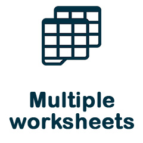

[](https://packagist.org/packages/avadim/fast-excel-writer) 
[](https://packagist.org/packages/avadim/fast-excel-writer) 
[](https://packagist.org/packages/avadim/fast-excel-writer) 
[](https://packagist.org/packages/avadim/fast-excel-writer)

<table border="0">
<tr>
<td valign="top"></td>
<td valign="top">
<p align="center">



<br>


</p>

<h1 align="center"><b>FastExcelWriter v.6</b></h1>
</td>
</tr>
</table>

**FastExcelWriter** is a part of the **FastExcelPhp Project** which consists of

* [FastExcelWriter](https://packagist.org/packages/avadim/fast-excel-writer) - to create Excel spreadsheets
* [FastExcelReader](https://packagist.org/packages/avadim/fast-excel-reader) - to read Excel spreadsheets
* [FastExcelTemplator](https://packagist.org/packages/avadim/fast-excel-templator) - to generate Excel spreadsheets from XLSX templates
* [FastExcelLaravel](https://packagist.org/packages/avadim/fast-excel-laravel) - special **Laravel** edition

## Introduction

This library is designed to be lightweight, super-fast and requires minimal memory usage.

**FastExcelWriter** creates Excel compatible spreadsheets in XLSX format (Office 2007+), with many features supported:

* Takes UTF-8 encoded input
* Multiple worksheets
* Supports currency/date/numeric cell formatting, formulas and active hyperlinks
* Supports most styling options for cells, rows, columns - colors, borders, fonts, etc.
* You can set the height of the rows and the width of the columns (including auto width calculation)
* You can add formulas, notes and images in you XLSX-files
* Supports workbook and sheet protection with/without passwords 
* Supports page settings - page margins, page size
* Inserting multiple charts
* Supports data validations and conditional formatting

Jump To:
* [Changes in version 6](#changes-in-version-6)
  * [Important changes in version 6.1](#important-changes-in-version-61)
* [Changes in version 5](#changes-in-version-5)
  * [Important changes in version 5.8](#important-changes-in-version-58)
* [Simple Example](#simple-example)
* [Advanced Example](#advanced-example)
* [Adding Notes](#adding-notes)
* [Adding Images](#adding-images)
* [Workbook](/docs/01-workbook.md)
  * [Workbook settings](/docs/01-workbook.md#workbook-settings)
  * [Sets metadata of workbook](/docs/01-workbook.md#sets-metadata-of-workbook)
  * [Set Directory For Temporary Files](/docs/01-workbook.md#set-directory-for-temporary-files)
  * [Helpers methods](/docs/01-workbook.md#helpers-methods)
* [Sheets](/docs/02-sheets.md)
  * [Create, select and remove sheet](/docs/02-sheets.md#create-select-and-remove-sheet)
  * [Sheet settings](/docs/02-sheets.md#sheet-settings)
  * [Page settings](/docs/02-sheets.md#page-settings)
  * [Row's settings](/docs/02-sheets.md#rows-settings)
  * [Column's settings](/docs/02-sheets.md#columns-settings)
  * [Automatic column widths](/docs/02-sheets.md#automatic-column-widths)
  * [Group/outline rows and columns](/docs/02-sheets.md#groupoutline-rows-and-columns)
  * [Define Named Ranges](/docs/02-sheets.md#define-named-ranges)
  * [Freeze Panes and Autofilter](/docs/02-sheets.md#freeze-panes-and-autofilter)
  * [Setting Active Sheet and Cells](/docs/02-sheets.md#setting-active-sheet-and-cells)
  * [Print Settings](/docs/02-sheets.md#print-settings)
* [Writing](/docs/03-writing.md)
  * [Writing Row by Row vs Direct](/docs/03-writing.md#writing-row-by-row-vs-direct)
  * [Direct Writing To Cells](/docs/03-writing.md#direct-writing-to-cells)
  * [Writing Cell Values](/docs/03-writing.md#writing-cell-values)
  * [Merging Cells](/docs/03-writing.md#merging-cells)
  * [Cell Formats](/docs/03-writing.md#cell-formats)
  * [Formulas](/docs/03-writing.md#formulas)
  * [Hyperlinks](/docs/03-writing.md#hyperlinks)
  * [Using Rich Text](/docs/03-writing.md#using-rich-text)
* [Styles](/docs/04-styles.md)
  * [Cell Styles](/docs/04-styles.md#cell-styles)
  * [Row Styles](/docs/04-styles.md#row-styles)
  * [Column Styles](/docs/04-styles.md#column-styles)
  * [Other Columns Options](/docs/04-styles.md#other-columns-options)
  * [Apply Styles (The Fluent Interface)](/docs/04-styles.md#apply-styles-the-fluent-interface)
  * [Apply Borders](/docs/04-styles.md#apply-borders)
  * [Apply Fonts](/docs/04-styles.md#apply-fonts)
  * [Apply Colors](/docs/04-styles.md#apply-colors)
  * [Apply Text Styles](/docs/04-styles.md#apply-text-styles)
* [Charts](/docs/05-charts.md)
  * [Simple usage](/docs/05-charts.md#simple-usage-of-chart)
  * [Combo charts](/docs/05-charts.md#combo-charts)
  * [Multiple charts](/docs/05-charts.md#multiple-charts)
  * [Chart types](/docs/05-charts.md#chart-types)
  * [Useful Chart Methods](/docs/05-charts.md#useful-chart-methods)
* [Protection of workbook and sheets](/docs/06-protection.md)
  * [Workbook protection](/docs/06-protection.md#workbook-protection)
  * [Sheet protection](/docs/06-protection.md#sheet-protection)
  * [Cells locking/unlocking](/docs/06-protection.md#cells-lockingunlocking)
* [Data validation](/docs/07-validation.md)
  * [Simple usage](/docs/07-validation.md#simple-usage)
  * [Define filters](/docs/07-validation.md#define-filters)
  * [Check type of value](/docs/07-validation.md#check-type-of-value)
  * [Custom filters](/docs/07-validation.md#custom-filters)
  * [All Data Validation settings](/docs/07-validation.md#all-data-validation-settings)
* [Conditional Formatting](/docs/08-conditional.md)
  * [Simple usage](/docs/08-conditional.md#simple-usage)
  * [General cell value check](/docs/08-conditional.md#general-cell-value-check)
  * [Expressions](/docs/08-conditional.md#expressions)
  * [Gradient fill depending on values (colorScale)](/docs/08-conditional.md#gradient-fill-depending-on-values-colorscale)
  * [Data strip inside a cell (dataBar)](/docs/08-conditional.md#data-strip-inside-a-cell-databar)
* [API Reference](/docs/90-api-reference.md)
* [FastExcelWriter vs PhpSpreadsheet](#fastexcelwriter-vs-phpspreadsheet)
* [Do you want to support FastExcelWriter?](#do-you-want-to-support-fastexcelwriter)


## Installation

Use `composer` to install **FastExcelWriter** into your project:

```
composer require avadim/fast-excel-writer
```

## Changes In Version 6

* Data Validation support

### Important changes in version 6.1
* ```Sheet::setRowOptions()```, ```Sheet::setColOptions()```, ```Sheet::setRowStyles()``` and ```Sheet::setColStyles()``` 
are deprecated, instead of them you should use other functions: ```setRowStyle()```, ```setRowStyleArray()```, 
```setRowDataStyle()```, ```setRowDataStyleArray()```, ```setColStyle()```, ```setColStyleArray()```, ```setColDataStyle()```, ```setColDataStyleArray()```
* The behavior of the ```Sheet::setRowStyle()``` and ```Sheet::setColStyle()``` has changed, they now set styles for the entire row or column (even if they are empty)

## Changes In Version 5

* The general news is Chart support

### Important changes in version 5.8

Before v.5.8
```php
$sheet->writeCell(12345); // The number 12345 will be written into the cell
$sheet->writeCell('12345'); // The number 12345 will also be written here

```

In version 5.8 and later
```php
$sheet->writeCell(12345); // The number 12345 will be written into the cell
$sheet->writeCell('12345'); // Here the string '12345' will be written into the cell

```
If you want to keep the previous behavior for backward compatibility, 
you should use option 'auto_convert_number' when creating a workbook.
```php
$excel = Excel::create(['Sheet1'], ['auto_convert_number' => true]);
$sheet = $excel->sheet();
$sheet->writeCell('12345'); // String '12345' will be automatically converted to a number

```
## Changes In Version 4

* Now the library works even faster
* Added a fluent interface for applying styles.
* New methods and code refactoring


## Usage

You can find usage examples below or in */demo* folder

### Simple Example
```php
use \avadim\FastExcelWriter\Excel;

$data = [
    ['2003-12-31', 'James', '220'],
    ['2003-8-23', 'Mike', '153.5'],
    ['2003-06-01', 'John', '34.12'],
];

$excel = Excel::create(['Sheet1']);
$sheet = $excel->sheet();

// Write heads
$sheet->writeRow(['Date', 'Name', 'Amount']);

// Write data
foreach($data as $rowData) {
    $rowOptions = [
        'height' => 20,
    ];
    $sheet->writeRow($rowData, $rowOptions);
}

$excel->save('simple.xlsx');
```
Also, you can download generated file to client (send to browser)
```php
$excel->download('download.xlsx');
```

### Advanced Example

```php
use \avadim\FastExcelWriter\Excel;

$head = ['Date', 'Name', 'Amount'];
$data = [
    ['2003-12-31', 'James', '220'],
    ['2003-8-23', 'Mike', '153.5'],
    ['2003-06-01', 'John', '34.12'],
];
$headStyle = [
    'font' => [
        'style' => 'bold'
    ],
    'text-align' => 'center',
    'vertical-align' => 'center',
    'border' => 'thin',
    'height' => 24,
];

$excel = Excel::create(['Sheet1']);
$sheet = $excel->sheet();

// Write the head row (sets style via array)
$sheet->writeHeader($head, $headStyle);

// The same result with new fluent interface
$sheet->writeHeader($head)
    ->applyFontStyleBold()
    ->applyTextAlign('center', 'center')
    ->applyBorder(Style::BORDER_STYLE_THIN)
    ->applyRowHeight(24);

// Sets columns options - format and width (the first way)
$sheet
    ->setColFormats(['@date', '@text', '0.00'])
    ->setColWidths([12, 14, 5]);

// The seconds way to set columns options
$sheet
    // column and options
    ->setColDataStyle('A', ['format' => '@date', 'width' => 12])
    // column letter in lower case
    ->setColDataStyle('b', ['format' => '@text', 'width' => 24])
    // column can be specified by number
    ->setColDataStyle(3, ['format' => '0.00', 'width' => 15, 'color' => '#090'])
;

// The third way - all options in multilevel array (first level keys point to columns)
$sheet
    ->setColDataStyle([
        'A' => ['format' => '@date', 'width' => 12],
        'B' => ['format' => '@text', 'width' => 24],
        'C' => ['format' => '0.00', 'width' => 15, 'color' => '#090'],
    ]);

$rowNum = 1;
foreach($data as $rowData) {
    $rowOptions = [
        'height' => 20,
    ];
    if ($rowNum % 2) {
        $rowOptions['fill-color'] = '#eee';
    }
    $sheet->writeRow($rowData, $rowOptions);
}

$excel->save('simple.xlsx');
```


###  Adding Notes

There are currently two types of comments in Excel - **comments** and **notes** 
(see [The difference between threaded comments and notes](https://support.microsoft.com/en-us/office/the-difference-between-threaded-comments-and-notes-75a51eec-4092-42ab-abf8-7669077b7be3)).
Notes are old style comments in Excel (text on a light yellow background). 
You can add notes to any cells using method ```addNote()```

```php

$sheet->writeCell('Text to A1');
$sheet->addNote('A1', 'This is a note for cell A1');

$sheet->writeCell('Text to B1')->addNote('This is a note for B1');
$sheet->writeTo('C4', 'Text to C4')->addNote('Note for C1');

// If you specify a range of cells, then the note will be added to the left top cell
$sheet->addNote('E4:F8', "This note\nwill added to E4");

// You can split text into multiple lines
$sheet->addNote('D7', "Line 1\nLine 2");

```

You can change some note options. Allowed options of a note are:
* **width** - default value is ```'96pt'```
* **height** - default value is ```'55.5pt'```
* **fill_color** - default value is ```'#FFFFE1'```
* **show** - default value is ```false```

```php

$sheet->addNote('A1', 'This is a note for cell A1', ['width' => '200pt', 'height' => '100pt', 'fill_color' => '#ffcccc']);

// Parameters "width" and "height" can be numeric, by default these values are in points
// The "fill_color" parameter can be shortened
$noteStyle = [
    'width' => 200, // equivalent to '200pt'
    'height' => 100, // equivalent to '100pt'
    'fill_color' => 'fcc', // equivalent to '#ffcccc'
];
$sheet->writeCell('Text to B1')->addNote('This is a note for B1', $noteStyle);

// This note is visible when the Excel workbook is displayed
$sheet->addNote('C8', 'This note is always visible', ['show' => true]);
```

Also, you can use rich text in notes

```php
$richText = new \avadim\FastExcelWriter\RichText('here is <c=f00>red</c> and <c=00f>blue</c> text');
$sheet->addNote('C8', $richText);
```

For more information on using rich text, see here: [Using Rich Text](/docs/03-writing.md#using-rich-text)

###  Adding Images

You can insert image to sheet from local file, URL or image string in base64

```php
$sheet->addImage($cell, $imageFile, $imageStyle);

// Insert an image to the cell A1 from local path
$sheet->addImage('A1', 'path/to/file');

// Insert an image to the cell A1 from URL
$sheet->addImage('A1', 'https://site.com/image.jpg');

// Insert an image to the cell A1 from base64 string
$sheet->addImage('A1', 'data:image/jpeg;base64,/9j/4AAQ...');

// Insert an image to the cell B2 and set with to 150 pixels (height will change proportionally)
$sheet->addImage('B2', 'path/to/file', ['width' => 150]);

// Set height to 150 pixels (with will change proportionally)
$sheet->addImage('C3', 'path/to/file', ['height' => 150]);

// Set size in pixels
$sheet->addImage('D4', 'path/to/file', ['width' => 150, 'height' => 150]);

// Add hyperlink to the image
$sheet->addImage('D4', 'path/to/file', ['width' => 150, 'height' => 150, 'hyperlink' => 'https://www.google.com/']);
```

Available keys of image style:
* 'width' -- width of image
* 'height' -- height of image
* 'hyperlink' -- URL of hyperlink
* 'x' -- offset in pixels relative to the left border of the cell 
* 'y' -- offset in pixels relative to the top border of the cell

**IMPORTANT:** in MS Excel, value 'x' cannot be greater than the column width of the parent cell, 
and value 'y' cannot be greater than the row height 

## Shared Strings

By default, strings are written directly to sheets. This increases the file size a little, 
but speeds up data writing and saves memory. If you want strings to be written to the shared string xml, 
you need to use the 'shared_string' option.
```php
$excel = Excel::create([], ['shared_string' => true]);
```

## **FastExcelWriter** vs **PhpSpreadsheet**

**PhpSpreadsheet** is a perfect library with wonderful features for reading and writing many document formats.
**FastExcelWriter** can only write and only in XLSX format, but does it very fast
and with minimal memory usage.

**FastExcelWriter**:
* 7-9 times faster
* uses less memory by 8-10 times
* supports writing huge 100K+ row spreadsheets

Benchmark of PhpSpreadsheet (generation without styles)

| Rows x Cols | Time      | Memory     |
|-------------|-----------|------------|
| 1000 x 5    | 0.98 sec  | 2,048 Kb   |
| 1000 x 25   | 4.68 sec  | 14,336 Kb  |
| 5000 x 25   | 23.19 sec | 77,824 Kb  |
| 10000 x 50  | 105.8 sec | 256,000 Kb |

Benchmark of FastExcelWriter (generation without styles)

| Rows x Cols | Time      | Memory   |
|-------------|-----------|----------|
| 1000 x 5    | 0.19 sec  | 2,048 Kb |
| 1000 x 25   | 1.36 sec  | 2,048 Kb |
| 5000 x 25   | 3.61 sec  | 2,048 Kb |
| 10000 x 50  | 13.02 sec | 2,048 Kb |

## Do you want to support FastExcelWriter?

if you find this package useful you can support and donate to me for a cup of coffee:

* USDT (TRC20) TSsUFvJehQBJCKeYgNNR1cpswY6JZnbZK7
* USDT (ERC20) 0x5244519D65035aF868a010C2f68a086F473FC82b
* ETH 0x5244519D65035aF868a010C2f68a086F473FC82b

Or just give me a star on GitHub :)