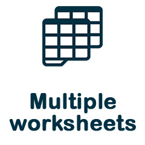

[English](README.md) | **Русский**

[](https://packagist.org/packages/avadim/fast-excel-writer) 
[](https://packagist.org/packages/avadim/fast-excel-writer) 
[](https://packagist.org/packages/avadim/fast-excel-writer) 
[](https://packagist.org/packages/avadim/fast-excel-writer)

<table border="0">
<tr>
<td valign="top"></td>
<td valign="top">
<p align="center">



<br>


</p>

<h1 align="center"><b>FastExcelWriter v.6</b></h1>
</td>
</tr>
</table>

**FastExcelWriter** — часть проекта **FastExcelPhp**, в который входят

* [FastExcelWriter](https://packagist.org/packages/avadim/fast-excel-writer) - создание таблиц Excel
* [FastExcelReader](https://packagist.org/packages/avadim/fast-excel-reader) - чтение таблиц Excel
* [FastExcelTemplator](https://packagist.org/packages/avadim/fast-excel-templator) - генерация таблиц Excel из XLSX-шаблонов
* [FastExcelLaravel](https://packagist.org/packages/avadim/fast-excel-laravel) - специальная редакция для **Laravel**

## О библиотеке

Лёгкая, мощная и очень быстрая библиотека для создания XLSX-таблиц на чистом PHP.
Она спроектирована так, чтобы работать максимально быстро и потреблять минимум памяти.

**FastExcelWriter** создаёт таблицы в формате XLSX, совместимые с MS Excel (Office 2007+), LibreOffice, OpenOffice и другими,
и поддерживает множество возможностей:

* Принимает данные в кодировке UTF-8
* Несколько листов в одной книге
* Поддерживает валютные, датовые и числовые форматы ячеек, формулы и активные гиперссылки
* Поддерживает большинство параметров стилей для ячеек, строк и колонок — цвета, границы, шрифты и т.д.
* Можно задавать высоту строк и ширину колонок (включая автоматический расчёт ширины)
* Можно добавлять формулы, заметки и изображения в XLSX-файлы
* Поддерживает защиту книги и листов с паролем и без него
* Поддерживает параметры страницы — поля, размер бумаги
* Вставка нескольких диаграмм
* Поддерживает проверку данных (data validation) и условное форматирование

Минимально необходимая версия PHP — 7.4

## Установка

Установите **FastExcelWriter** в свой проект с помощью `composer`:

```
composer require avadim/fast-excel-writer
```

## Быстрый старт

```php
use \avadim\FastExcelWriter\Excel;
use \avadim\FastExcelWriter\Style\Style;

$data = [
    ['2003-12-31', 'James', '220'],
    ['2003-8-23', 'Mike', '153.5'],
    ['2003-06-01', 'John', '34.12'],
];

$excel = Excel::create(['Sheet1']);
$sheet = $excel->sheet();

// Записываем строку заголовков и задаём стили через fluent-интерфейс
$sheet->writeHeader(['Date', 'Name', 'Amount'])
    ->applyFontStyleBold()
    ->applyBorder(Style::BORDER_STYLE_THIN);

// Задаём форматы и ширину колонок
$sheet
    ->setColFormats(['@date', '@text', '0.00'])
    ->setColWidths([12, 14, 8]);

// Записываем данные
foreach ($data as $rowData) {
    $sheet->writeRow($rowData);
}

// Сохраняем в файл
$excel->save('simple.xlsx');

// ...или отдаём сгенерированный файл клиенту (отправляем в браузер)
// $excel->download('simple.xlsx');
```

## Документация

Подробнее — в документации [здесь](/docs/index.ru.md) или [здесь](https://fast-excel-writer.readthedocs.io/en/latest/ru/index.html). 
Также есть [справочник API](/docs/90-api-reference.ru.md). 
Примеры можно посмотреть в папке ```/demo```.

Обновляетесь со старой версии? Смотрите [руководство по обновлению](/docs/09-upgrade.ru.md).

Список изменений — [здесь](CHANGELOG.md).

## **FastExcelWriter** vs **PhpSpreadsheet**

**PhpSpreadsheet** — отличная библиотека с богатыми возможностями чтения и записи множества форматов документов.
**FastExcelWriter** умеет только записывать и только в формате XLSX, но делает это очень быстро
и с минимальным потреблением памяти.

**FastExcelWriter**:
* в 7–9 раз быстрее
* потребляет в 8–10 раз меньше памяти
* поддерживает запись огромных таблиц в 100K+ строк

Бенчмарк PhpSpreadsheet (генерация без стилей)

| Строк x Колонок | Время     | Память     |
|-----------------|-----------|------------|
| 1000 x 5        | 0.98 sec  | 2,048 Kb   |
| 1000 x 25       | 4.68 sec  | 14,336 Kb  |
| 5000 x 25       | 23.19 sec | 77,824 Kb  |
| 10000 x 50      | 105.8 sec | 256,000 Kb |

Бенчмарк FastExcelWriter (генерация без стилей)

| Строк x Колонок | Время     | Память   |
|-----------------|-----------|----------|
| 1000 x 5        | 0.19 sec  | 2,048 Kb |
| 1000 x 25       | 1.36 sec  | 2,048 Kb |
| 5000 x 25       | 3.61 sec  | 2,048 Kb |
| 10000 x 50      | 13.02 sec | 2,048 Kb |

## Хотите поддержать FastExcelWriter?

Если библиотека оказалась вам полезной, вы можете поддержать автора и задонатить ему на чашку кофе:

* USDT (TRC20) TSsUFvJehQBJCKeYgNNR1cpswY6JZnbZK7
* USDT (ERC20) 0x5244519D65035aF868a010C2f68a086F473FC82b
* ETH 0x5244519D65035aF868a010C2f68a086F473FC82b

Или просто поставьте звёздочку на GitHub :)
