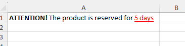

## FastExcelWriter - Sheets

### Writing Row by Row vs Direct

There are two ways to write to a XLSX-file in the library - sequential (row by row) and direct. 
When you use "row by row" writing, cells are written to the file as soon as you move to the next row. 
And you can no longer write something into the cells of the previous rows. 
This allows you to write quickly and save memory.

**Note: Any Sheet class writing functions use row-by-row way,
while Area class functions use direct writing**

```php
$excel = Excel::create(['Sheet1']);
$sheet = $excel->sheet(); 
// now position of internal record pointer is "A1"

$sheet->writeCell('...'); 
// ^^^ write to A1 and move position of internal record pointer to "B1"

$sheet->writeCell('...'); 
// ^^^ position of internal record pointer is "C1"

$sheet->nextCell(); 
// ^^^ move position of internal record pointer to "D1"

$sheet->nextCell(); 
// ^^^ position of internal record pointer is "E1"

// we can write to any cell of the current row
$sheet->writeTo('G1', '...'); 
// ^^^ write value to G1 and move pointer to the H1

$sheet->writeTo('F1', '...'); 
// ^^^ we can write to previous cell of the current row

// function writeRow() always flush current row to the file and writes new values to the next row
$sheet->writeRow(['a', 'b', 'c']);
// ^^^ internal pointer moves to the next row 2

$sheet->cell('B2')->applyBgColor('#ccc');
// ^^^ you can change cells in the row 2 (this is the current row)

// but you can't write to the previous row
$sheet->cell('B1')->applyBgColor('#ccc');
// ^^^ ERROR! this code will throw an exception because B1 is in the previous row
```

You can write two-dimensional array

```php
//Data will be written to cells in the range E5:I8
$data = [
    ['', 'Q1', 'Q2', 'Q3', 'Q4'],
    ['2020', 111, 222, 333, 444],
    ['2021', 110, 220, 330, 440],
    ['2022', 100, 200, 300, 400],
];
$sheet1->writeArrayTo('E5', $data);

```

### Direct Writing To Cells

With direct writing, you first declare a writing area (or multiple areas) and write to it. 
In this case, you can write to arbitrary cells within the area, they will all be stored in memory and written to a file 
when you call functions Sheet::writeAreas() or Excel::save(). 
This method is more flexible, but requires more memory and is not recommended for large files.

```php
$excel = Excel::create();
$sheet = $excel->sheet();

// Make write area from A1 to max column and max row
$area = $sheet->beginArea();

// write to the row 3
$area->setValue('C3', 'text 3');
// then write to the row 2
$area->setValue('B2', 'text 2');
// then write to the row 1
$area->setValue('A1', 'text 1');

// Close and write all areas
$sheet->writeAreas();
```

You can define any number of areas, and they can overlap

```php
// Define are from D3 to max column and max row
$area1 = $sheet1->beginArea('D3');

// make write area from B4 to F12
$area2 = $sheet1->makeArea('B4:F12');
// you can define any number of areas and they can overlap
$area3 = $sheet1->makeArea('C6:G18'); 

// the left column will be D and the first row of this area is 3
$area1->writeRow([100, 101, 102]);
$area2->writeRow([200, 201, 202]);

// you can write value to any cell of area...
$area1->writeTo('H3', 'text');
// ...but if you try to write to a cell outside the area it will throw an exception
$area1->writeTo('B2', 'text');

// Close and write all areas
$sheet1->writeAreas();

```
You can write two-dimensional array

```php
// Define are from D3 to max column and max row
$area = $sheet1->beginArea('D3');
// But data will be written to cells from E5 to I8
$array = [
    ['', 'Q1', 'Q2', 'Q3', 'Q4'],
    ['2020', 111, 222, 333, 444],
    ['2021', 110, 220, 330, 440],
    ['2022', 100, 200, 300, 400],
];
$area->writeArrayTo('E5', $data);

```

### Writing Cell Values

Usually, values is written sequentially, cell by cell, row by row. Writing to a cell moves the internal pointer
to the next cell in the row, writing a row moves the pointer to the first cell of the next row.

```php
use \avadim\FastExcelWriter\Excel;

// Create workbook
$excel = Excel::create();

// Get the sheet on which we will write data
$sheet = $excel->sheet();

// Write data to cell by cell (the first cell is A1)
// Write number to A1 and the pointer moves to the next cell (B1)
$sheet->writeCell(123);

// Write string to B1 (pointer in C1)
$sheet->writeCell('abc');

// Pointer moves to the next cell (D1) without value writing
$sheet->nextCell();

// Write to B3 and moves pointer to C3. The pointer can only move from left to right and top to bottom
$sheet->writeTo('B3', 'value');
$sheet->writeTo('A4', 'value');

// Now we will write value to B4 with styling
$style = [
    'format' => '#,##0.00',
    'font-color' => '#ff0000',
    'tex-align' => 'center',
];
$sheet->writeCell(0.9, $style);

// this code will throw an exception because C3 is in the previous row
$sheet->writeTo('C3', 'value');

```

You can write the entire row at once

```php
$excel = Excel::create();
$sheet = $excel->getSheet();

// Sheet::writeHeader(array header, ?array rowStyle)
// Sheet::writeRow(array row, ?array rowStyle)
// Sheet::nextRow()

// Write header values to the current row 
$sheet->writeHeader(['title1', 'title2']);

// Write header values to the current row and set format of columns A and B 
$sheet->writeHeader(['title1' => '@integer', 'title2' => '@date']);

$data = [
    [184, '2022-01-23'],
    [835, '1971-12-08'],
    [760, '1997-05-11'],
];

foreach ($data as $rowData) {
    $sheet->writeRow($rowData);
}

```
Also, you can define the top left cell for writing  
```php
$excel = Excel::create();
$sheet = $excel->getSheet();

// The first row is 3, all rows start in column B
$sheet->setTopLeftCell('B3');

// Write header values to the current row and set format of columns A and B 
$sheet->writeHeader(['title1' => '@integer', 'title2' => '@date'])->applyFontStyleBold();;

$data = [
    [184, '2022-01-23'],
    [835, '1971-12-08'],
    [760, '1997-05-11'],
];

foreach ($data as $rowData) {
    $sheet->writeRow($rowData);
}

```

### Merging Cells

```php
// Merge C4:E4, write value to merged cells
$sheet1->writeTo('C4:E4', 'other value');

// Write value to the cell
$sheet1->writeTo('D1', 'Title');
$sheet1->writeRow(['...']);
$sheet1->writeRow(['...']);
$sheet1->writeRow(['...']);

// Merge cells range
$sheet1->mergeCells('D1:F1');
```
**Note**: function mergeCells() does not write values or styles, it sets the properties of the sheet, 
so it can be called for previous rows when all the data has already been written.

Each time the mergeCells() method is called, a check is performed to see if the specified range overlaps with other merged cells. 
If the file being generated is large and there are many cells to be merged, this may slow down file generation.
If you are sure that your cells to be merged do not overlap, you can disable the check to speed up file generation by passing -1 as the second argument.

```php
$sheet1->mergeCells('D1:F1', -1);
$sheet1->mergeCells('D2:F2', -1);
$sheet1->mergeCells('D3:F3', -1);

```

### Cell Formats

You can use simple and advanced formats. Example of setting the format for each cell:

```php
$excel = Excel::create(['Formats']);
$sheet = $excel->sheet();

$sheet->writeCell(123456); // value 123456 as integer by default
$sheet->writeCell('123456'); // value '123456' as string by default
$sheet->writeCell(12.34); // float number 12.34
$sheet->writeCell(12.34, ['format' => '@money']); // money format
$sheet->writeCell(date('Y-m-d'), ['format' => '@date']); // date format
$sheet->writeCell(time(), ['format' => '@date']); // date format
```

You can also set the format for all column values.

```php
$sheet = $excel->sheet();

// define column names and format
$header = [
    'created' => '@date',
    'product_id' => '@integer',
    'quantity' => '#,##0',
    'amount' => '#,##0.00',
    'description' => '@string',
    'tax' => '[$$]#,##0.00;[RED]-[$$]#,##0.00',
];
$data = [
    ['2015-01-01', 873, 1, 44.00, 'misc', '=D2*0.05'],
    ['2015-01-12', 324, 2, 88.00, 'none', '=D3*0.15'],
];

$sheet->writeHeader($header);
foreach($data as $row) {
    $sheet->writeRow($row );
}

$excel->save('formats.xlsx');
```

Simple cell formats map to more advanced cell formats

| simple formats | format code         |
|----------------|---------------------|
| @text          | @                   |
| @string        | @                   |
| @integer       | 0                   |
| @date          | YYYY-MM-DD          |
| @datetime      | YYYY-MM-DD HH:MM:SS |
| @time          | HH:MM:SS            |
| @money         | [$$]#,##0.00        |


### Formulas

Formulas must start with '='. If you want to write the formula as a text, use a backslash.
Setting the locale allows the use of national language function names.
You can use both A1 and R1C1 notations in formulas.

You must comply with the following rules:
* Formulas must start with '='
* Decimal separator in float numbers is '.'
* Function argument separator is ','
* Matrix row separator is ';'
```php
use \avadim\FastExcelWriter\Excel;

$excel = Excel::create(['Formulas']);
$sheet = $excel->getSheet();

// Set Russian locale
$excel->setLocale('ru');

$headRow = [];

$sheet->writeRow([1, random_int(100, 999), '=RC[-1]*0.1']);
$sheet->writeRow([2, random_int(100, 999), '=RC[-1]*0.1']);
$sheet->writeRow([3, random_int(100, 999), '=RC[-1]*0.1']);

$totalRow = [
    'Total',
    '=SUM(B1:B3)', // English function name
    '=СУММ(C1:C3)', // You can use Russian function name because the locale is 'ru'
];

$sheet->writeRow($totalRow);

$excel->save('formulas.xlsx');

```
Setting the locale allows the use of national language function names.
```php
$excel = Excel::create();
// Set Portuguese locale
$excel->setLocale('pt');
$sheet = $excel->getSheet();

$sheet->writeTo('A1', '=SE(FALSO,1.23+A4,4.56+B3)');

```

You can define formula for the specified column

```php
$sheet1->setColFormula('C', '=RC[-1]*0.1');

// We write values only to columns 'A' and 'B', formula to 'C' will be added automatically
$sheet1->writeRow([100, 230]);
$sheet1->writeRow([120, 560]);
$sheet1->writeRow([130, 117]);
```

**Important!** The library cannot pre-calculate values of formulas. It save formulas as is, without pre-calculation.
But when the saved file is opened in Excel, Excel recalculates all cells with formulas and show results.
There's only one way to save pre-calculations: you do those calculations in your code and save them along with the formula
```php
$a1 = 10;
$b1 = 30;
$a2 = 50;
$b2 = 70;
$sheet->writeRow([$a1, $b1]);
$sheet->writeRow([$a2, $b2]);

// formula and pre-calculated result
$a3 = ['=A1+A2', $a1 + $a2];
$b3 = ['=B1+B2', $b1 + $b2];
$sheet->writeRow([$a3, $b3]);
```


### Hyperlinks
You can insert URLs as active hyperlinks

```php
// Write URL as simple string (not hyperlink)
$sheet1->writeCell('https://google.com');

// Write URL as an active hyperlink
$sheet1->writeCell('https://google.com', ['hyperlink' => true]);

// Write text with an active hyperlink
$sheet1->writeCell('Google', ['hyperlink' => 'https://google.com']);

```
Write hyperlink using writeRow()

```php
$rowValues = [
    'text',
    'http://google.com',
    123456,
];
$rowStyle = [];
$cellStyles = [
    [], // style for the first cell,
    ['hyperlink' => true], // 2nd cell
    [], // 3rd cell
];

$sheet1->writeRow($rowValues, $rowStyle, $cellStyles);
```
Here is the other way
```php
$cellStyles = [
    'B' => ['hyperlink' => true],
];
```

### Using Rich Text

Writing rich text to a cell can be done using RichText instances. Here's an example, which creates the following rich text string:



```php
$richText = new \avadim\FastExcelWriter\RichText();
$richText->addText('ATTENTION!')->setBold();
$richText->addText(' The product is reserved for ');
$richText->addText('5 days')->setUnderline();

$sheet->writeCell($richText);
$sheet->writeTo('B2', $richText);
$sheet->writeRow(['plain text', $richText]);

```

You can use the following functions to format rich text:
* setBold()
* setItalic()
* setUnderline()
* setFont($fontName)
* setSize($size)
* setColor($color)

Also, you can use simple tags to format rich text

```php
$richText = new \avadim\FastExcelWriter\RichText('<b>ATTENTION!</b> The product is reserved for <u>5 days</u>');
$sheet->writeTo('B2', $richText);
```

The following tags can be used:

| short tag       | full tag            | example                          |
|-----------------|---------------------|----------------------------------|
| \<b\>           | \<bold\>            | \<b\>bold text\</b\>             |
| \<i\>           | \<italic\>          | \<i\>italic text\</i\>           |
| \<u\>           | \<underline\>       | \<u\>underline text\</u\>        |
| \<f=fontName\>  | \<font=fontName\>   | \<f="Times New Roman"\>text\<f\> |
| \<s=fontSize\>  | \<size=fontSize\>   | \<s=18\>text with size 18\</s\>  |
| \<c=fontColor\> | \<color=fontColor\> | \<c="#f0b5d4"\>colored text\</c> |

Returns to [README.md](/README.md)
