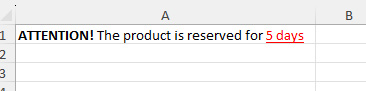

## FastExcelWriter – Запись данных

### Построчная и прямая запись { #writing-row-by-row-vs-direct }

В библиотеке есть два способа записи в XLSX-файл — последовательный (построчный) и прямой.
При построчной записи ячейки записываются в файл сразу при переходе к следующей строке.
После этого записать что-либо в ячейки предыдущих строк уже нельзя.
Это позволяет писать быстро и экономить память.

**Примечание: все функции записи класса Sheet используют построчный способ,
а функции класса Area — прямую запись**

```php
$excel = Excel::create(['Sheet1']);
$sheet = $excel->sheet(); 
// сейчас внутренний указатель записи находится в "A1"

$sheet->writeCell('...'); 
// ^^^ записываем в A1, указатель перемещается в "B1"

$sheet->writeCell('...'); 
// ^^^ указатель находится в "C1"

$sheet->nextCell(); 
// ^^^ перемещаем указатель в "D1"

$sheet->nextCell(); 
// ^^^ указатель находится в "E1"

// можно записать в любую ячейку текущей строки
$sheet->writeTo('G1', '...'); 
// ^^^ записываем значение в G1, указатель перемещается в H1

$sheet->writeTo('F1', '...'); 
// ^^^ можно записать и в предыдущую ячейку текущей строки

// функция writeRow() всегда сбрасывает текущую строку в файл и записывает новые значения в следующую строку
$sheet->writeRow(['a', 'b', 'c']);
// ^^^ внутренний указатель перемещается на следующую строку 2

$sheet->cell('B2')->applyBgColor('#ccc');
// ^^^ можно менять ячейки строки 2 (это текущая строка)

// но нельзя записать в предыдущую строку
$sheet->cell('B1')->applyBgColor('#ccc');
// ^^^ ОШИБКА! этот код выбросит исключение, потому что B1 находится в предыдущей строке
```

Можно записать двумерный массив

```php
// Данные будут записаны в ячейки диапазона E5:I8
$data = [
    ['', 'Q1', 'Q2', 'Q3', 'Q4'],
    ['2020', 111, 222, 333, 444],
    ['2021', 110, 220, 330, 440],
    ['2022', 100, 200, 300, 400],
];
$sheet->writeArrayTo('E5', $data);

```

### Прямая запись в ячейки

При прямой записи вы сначала объявляете область записи (или несколько областей) и пишете в неё.
В этом случае можно писать в произвольные ячейки внутри области — все они хранятся в памяти и записываются в файл
при вызове функций Sheet::writeAreas() или Excel::save().
Этот способ более гибкий, но требует больше памяти и не рекомендуется для больших файлов.

```php
$excel = Excel::create();
$sheet = $excel->sheet();

// Создаём область записи от A1 до максимальной колонки и максимальной строки
$area = $sheet->beginArea();

// пишем в строку 3
$area->setValue('C3', 'text 3');
// затем в строку 2
$area->setValue('B2', 'text 2');
// затем в строку 1
$area->setValue('A1', 'text 1');

// Закрываем и записываем все области
$sheet->writeAreas();
```

Можно определить любое количество областей, и они могут пересекаться

```php
// Определяем область от D3 до максимальной колонки и максимальной строки
$area1 = $sheet->beginArea('D3');

// создаём область записи от B4 до F12
$area2 = $sheet->makeArea('B4:F12');
// областей может быть сколько угодно, и они могут пересекаться
$area3 = $sheet->makeArea('C6:G18'); 

// левая колонка этой области — D, первая строка — 3
$area1->writeRow([100, 101, 102]);
$area2->writeRow([200, 201, 202]);

// можно записать значение в любую ячейку области...
$area1->writeTo('H3', 'text');
// ...но попытка записи в ячейку вне области выбросит исключение
$area1->writeTo('B2', 'text');

// Закрываем и записываем все области
$sheet->writeAreas();

```
Можно записать двумерный массив

```php
// Определяем область от D3 до максимальной колонки и максимальной строки
$area = $sheet->beginArea('D3');
// Но данные будут записаны в ячейки от E5 до I8
$array = [
    ['', 'Q1', 'Q2', 'Q3', 'Q4'],
    ['2020', 111, 222, 333, 444],
    ['2021', 110, 220, 330, 440],
    ['2022', 100, 200, 300, 400],
];
$area->writeArrayTo('E5', $data);

```

### Запись значений в ячейки

Обычно значения записываются последовательно — ячейка за ячейкой, строка за строкой. Запись в ячейку перемещает
внутренний указатель на следующую ячейку строки, запись строки перемещает указатель на первую ячейку следующей строки.

```php
use \avadim\FastExcelWriter\Excel;

// Создаём книгу
$excel = Excel::create();

// Получаем лист, на который будем записывать данные
$sheet = $excel->sheet();

// Записываем данные ячейка за ячейкой (первая ячейка — A1)
// Записываем число в A1, указатель перемещается на следующую ячейку (B1)
$sheet->writeCell(123);

// Записываем строку в B1 (указатель в C1)
$sheet->writeCell('abc');

// Указатель перемещается на следующую ячейку (D1) без записи значения
$sheet->nextCell();

// Записываем в B3, указатель перемещается в C3. Указатель может двигаться только слева направо и сверху вниз
$sheet->writeTo('B3', 'value');
$sheet->writeTo('A4', 'value');

// Теперь запишем значение в B4 со стилем
$style = [
    'format' => '#,##0.00',
    'font-color' => '#ff0000',
    'text-align' => 'center',
];
$sheet->writeCell(0.9, $style);

// этот код выбросит исключение, потому что C3 находится в предыдущей строке
$sheet->writeTo('C3', 'value');

```

Можно записать всю строку сразу

```php
$excel = Excel::create();
$sheet = $excel->getSheet();

// Sheet::writeHeader(array header, ?array rowStyle)
// Sheet::writeRow(array row, ?array rowStyle)
// Sheet::nextRow()

// Записываем значения заголовков в текущую строку 
$sheet->writeHeader(['title1', 'title2']);

// Записываем значения заголовков в текущую строку и задаём форматы колонок A и B 
$sheet->writeHeader(['title1' => '@integer', 'title2' => '@date']);

$data = [
    [184, '2022-01-23'],
    [835, '1971-12-08'],
    [760, '1997-05-11'],
];

foreach ($data as $rowData) {
    $sheet->writeRow($rowData);
}

```
Также можно задать левую верхнюю ячейку записи  
```php
$excel = Excel::create();
$sheet = $excel->getSheet();

// Первая строка — 3, все строки начинаются с колонки B
$sheet->setTopLeftCell('B3');

// Записываем значения заголовков в текущую строку и задаём форматы колонок 
$sheet->writeHeader(['title1' => '@integer', 'title2' => '@date'])->applyFontStyleBold();

$data = [
    [184, '2022-01-23'],
    [835, '1971-12-08'],
    [760, '1997-05-11'],
];

foreach ($data as $rowData) {
    $sheet->writeRow($rowData);
}

```

### Ссылки в стиле R1C1

По умолчанию библиотека распознаёт адреса в стиле R1C1. Но это поведение можно изменить.

```php
$sheet = $excel->sheet();

// Текущая строка и колонка + 1 => B1
$sheet->writeTo('RC1', 'TEST 1');

// Можно отключить распознавание адресов R1C1
$excel->setR1C1(false);
// Значение будет записано в ячейку RC1 (колонка RC, строка 1)
$sheet->writeTo('RC1', 'TEST 2');
```

### Объединение ячеек

```php
// Объединяем C4:E4, записываем значение в объединённые ячейки
$sheet->writeTo('C4:E4', 'other value');

// Записываем значение в ячейку
$sheet->writeTo('D1', 'Title');
$sheet->writeRow(['...']);
$sheet->writeRow(['...']);
$sheet->writeRow(['...']);

// Объединяем диапазон ячеек
$sheet->mergeCells('D1:F1');
```
**Примечание**: функция mergeCells() не записывает значения и стили, а задаёт свойства листа,
поэтому её можно вызывать для предыдущих строк, когда все данные уже записаны.

При каждом вызове mergeCells() выполняется проверка, не пересекается ли указанный диапазон с другими объединёнными ячейками.
Если генерируемый файл большой и объединяемых ячеек много, это может замедлить генерацию файла.
Если вы уверены, что объединяемые ячейки не пересекаются, проверку можно отключить, передав -1 вторым аргументом.

```php
$sheet->mergeCells('D1:F1', -1);
$sheet->mergeCells('D2:F2', -1);
$sheet->mergeCells('D3:F3', -1);

```

### Форматы ячеек

Можно использовать простые и расширенные форматы. Пример задания формата для каждой ячейки:

```php
$excel = Excel::create(['Formats']);
$sheet = $excel->sheet();

$sheet->writeCell(123456); // значение 123456 как целое число (по умолчанию)
$sheet->writeCell('123456'); // значение '123456' как строка (по умолчанию)
$sheet->writeCell(12.34); // число с плавающей точкой 12.34
$sheet->writeCell(12.34, ['format' => '@money']); // денежный формат
$sheet->writeCell(date('Y-m-d'), ['format' => '@date']); // формат даты
$sheet->writeCell(time(), ['format' => '@date']); // формат даты
```

Формат можно задать и для всех значений колонки.

```php
$sheet = $excel->sheet();

// определяем имена и форматы колонок
$header = [
    'created' => '@date',
    'product_id' => '@integer',
    'quantity' => '#,##0',
    'amount' => '#,##0.00',
    'description' => '@string',
    'tax' => '[$$]#,##0.00;[RED]-[$$]#,##0.00',
];
$data = [
    ['2015-01-01', 873, 1, 44.00, 'misc', '=D2*0.05'],
    ['2015-01-12', 324, 2, 88.00, 'none', '=D3*0.15'],
];

$sheet->writeHeader($header);
foreach($data as $row) {
    $sheet->writeRow($row );
}

$excel->save('formats.xlsx');
```

Простые форматы ячеек соответствуют следующим кодам форматов

| простой формат | код формата         |
|----------------|---------------------|
| @text          | @                   |
| @string        | @                   |
| @integer       | 0                   |
| @date          | YYYY-MM-DD          |
| @datetime      | YYYY-MM-DD HH:MM:SS |
| @time          | HH:MM:SS            |
| @money         | [$$]#,##0.00        |


### Формулы { #formulas }

Формулы должны начинаться с '='. Если вы хотите записать формулу как текст, используйте обратный слеш.
Установка локали позволяет использовать имена функций на национальном языке.
В формулах можно использовать обе нотации — A1 и R1C1.

Необходимо соблюдать следующие правила:

* Формулы должны начинаться с '='
* Десятичный разделитель в числах с плавающей точкой — '.'
* Разделитель аргументов функций — ','
* Разделитель строк матрицы — ';'

```php
use \avadim\FastExcelWriter\Excel;

$excel = Excel::create(['Formulas']);
$sheet = $excel->getSheet();

// Устанавливаем русскую локаль
$excel->setLocale('ru');

$headRow = [];

$sheet->writeRow([1, random_int(100, 999), '=RC[-1]*0.1']);
$sheet->writeRow([2, random_int(100, 999), '=RC[-1]*0.1']);
$sheet->writeRow([3, random_int(100, 999), '=RC[-1]*0.1']);

$totalRow = [
    'Total',
    '=SUM(B1:B3)', // английское имя функции
    '=СУММ(C1:C3)', // можно использовать русское имя функции, потому что локаль 'ru'
];

$sheet->writeRow($totalRow);

$excel->save('formulas.xlsx');

```
Установка локали позволяет использовать имена функций на национальном языке.
```php
$excel = Excel::create();
// Устанавливаем португальскую локаль
$excel->setLocale('pt');
$sheet = $excel->getSheet();

$sheet->writeTo('A1', '=SE(FALSO,1.23+A4,4.56+B3)');

```

Можно определить формулу для указанной колонки

```php
$sheet->setColFormula('C', '=RC[-1]*0.1');

// Записываем значения только в колонки 'A' и 'B', формула в 'C' будет добавлена автоматически
$sheet->writeRow([100, 230]);
$sheet->writeRow([120, 560]);
$sheet->writeRow([130, 117]);
```

**Важно!** Библиотека не умеет предварительно вычислять значения формул. Она сохраняет формулы как есть,
без вычисления. Но когда сохранённый файл открывается в Excel, тот пересчитывает все ячейки с формулами и показывает результаты.
Есть только один способ сохранить вычисленные значения: выполнить вычисления в своём коде и сохранить их вместе с формулой
```php
$a1 = 10;
$b1 = 30;
$a2 = 50;
$b2 = 70;
$sheet->writeRow([$a1, $b1]);
$sheet->writeRow([$a2, $b2]);

// формула и заранее вычисленный результат
$a3 = ['=A1+A2', $a1 + $a2];
$b3 = ['=B1+B2', $b1 + $b2];
$sheet->writeRow([$a3, $b3]);
```


### Гиперссылки
URL можно вставлять как активные гиперссылки

```php
// Записываем URL как обычную строку (не гиперссылку)
$sheet->writeCell('https://google.com');

// Записываем URL как активную гиперссылку
$sheet->writeCell('https://google.com', ['hyperlink' => true]);

// Записываем текст с активной гиперссылкой
$sheet->writeCell('Google', ['hyperlink' => 'https://google.com']);

```
Запись гиперссылки с помощью writeRow()

```php
$rowValues = [
    'text',
    'http://google.com',
    123456,
];
$rowStyle = [];
$cellStyles = [
    [], // стиль первой ячейки,
    ['hyperlink' => true], // второй ячейки
    [], // третьей ячейки
];

$sheet->writeRow($rowValues, $rowStyle, $cellStyles);
```
Вот другой способ
```php
$cellStyles = [
    'B' => ['hyperlink' => true],
];
```

Внутренние гиперссылки на другие листы
```php
$sheet->writeCell('Internal link', ['hyperlink' => "'Sheet 1'!C7"]);

// Если имя листа не содержит пробелов, его можно писать без кавычек.
$sheet->writeCell('Internal link', ['hyperlink' => "Sheet1!C7"]);
```

Внешние гиперссылки на другую книгу
```php
// Кавычки обязательны, даже если имена файла и листа не содержат пробелов.
$sheet->writeCell('Workbook link', ['hyperlink' => "'[other_file.xlsx]Sheet1'!C7"]);
```

Для совместимости с phpSpreadsheet можно использовать такой синтаксис
```php
// если имя листа не содержит пробелов
$sheet->writeCell('Internal link', ['hyperlink' => "sheet://Sheet1!C7"]);

// Если имя листа с пробелами, нужны кавычки
$sheet->writeCell('Internal link', ['hyperlink' => "sheet://'Sheet 1'!C7"]);
```

### Форматированный текст (Rich Text) { #using-rich-text }

Записать форматированный текст в ячейку можно с помощью экземпляров RichText. Вот пример,
который создаёт следующую форматированную строку:



```php
$richText = new \avadim\FastExcelWriter\RichText\RichText();
$richText->addText('ATTENTION!')->setBold();
$richText->addText(' The product is reserved for ');
$richText->addText('5 days')->setUnderline()->setColor('red');

$sheet->writeCell($richText);
$sheet->writeTo('B2', $richText);
$sheet->writeRow(['plain text', $richText]);

```

Для форматирования фрагментов можно использовать следующие функции:

* setBold()
* setItalic()
* setUnderline()
* setFont($fontName)
* setSize($size)
* setColor($color)

Вот другой способ сделать то же самое
```php
$richText = new RichText('ATTENTION! ', 'The product is reserved for ', '5 days');

$richText->fragment(0)->setBold();
$richText->fragment(2)->setUnderline()->setColor('f00');

$sheet->writeCell($richText);

```

Также для форматирования можно использовать простые теги

```php
$richText = new \avadim\FastExcelWriter\RichText\RichText('<b>ATTENTION!</b> The product is reserved for <u><c=red>5 days</c></u>');
$sheet->writeTo('B2', $richText);
```

Можно использовать следующие теги:

| короткий тег    | полный тег          | пример                           |
|-----------------|---------------------|----------------------------------|
| \<b\>           | \<bold\>            | \<b\>bold text\</b\>             |
| \<i\>           | \<italic\>          | \<i\>italic text\</i\>           |
| \<u\>           | \<underline\>       | \<u\>underline text\</u\>        |
| \<f=fontName\>  | \<font=fontName\>   | \<f="Times New Roman"\>text\<f\> |
| \<s=fontSize\>  | \<size=fontSize\>   | \<s=18\>text with size 18\</s\>  |
| \<c=fontColor\> | \<color=fontColor\> | \<c="#f0b5d4"\>colored text\</c> |
