## FastExcelWriter – Диаграммы (с v.5.0)

В генерируемые таблицы можно вставлять диаграммы (примеры использования ниже и в папке */demo*)

### Простое использование диаграммы

```php
// Создаём книгу
$excel = Excel::create(['Chart Demo']);

$sheet = $excel->sheet();

$data = [
    ['',	2010,	2011,	2012],
    ['Q1',   12,   15,		21],
    ['Q2',   56,   73,		86],
    ['Q3',   52,   61,		69],
    ['Q4',   30,   32,		0],
];

foreach ($data as $row) {
    $sheet->writeRow($row);
}

// Определяем ряды данных диаграммы
$dataSeries = [
    // ключ — ячейка с именем ряда данных
    // значение — диапазон с данными ряда
    'B1' => 'B2:B5', 
    'C1' => 'c2:c5', 
    'D1' => 'd2:d5',
];

$chartTitle = 'Bar Chart';

// Создаём диаграмму
$chart = Chart::make(Chart::TYPE_COLUMN, $chartTitle, $dataSeries)
    // Подписи оси X
    ->setCategoryAxisLabels('A2:A5')
    // Положение легенды
    ->setLegendPosition(Legend::POSITION_TOPRIGHT)
;

//	Добавляем диаграмму на лист
$sheet->addChart('A7:H20', $chart);

// Сохраняем в XLSX-файл
$excel->save($outFileName);

```

### Расширенный пример

Когда вы используете простой адрес ```D8```, он всегда преобразуется в абсолютный адрес листа,
на который вставлена диаграмма: ```Worksheet!$D$8```
```php
$sheet = $excel->getSheet('Jan');
$chart = Chart::make(Chart::TYPE_COLUMN, $chartTitle, ['A1' => 'A2:A5']);

// Этот код даст тот же результат
$chart = Chart::make(Chart::TYPE_COLUMN, $chartTitle, ['Jan!$A$1' => 'Jan!$A$2:$A$5']);
```
В качестве подписей можно использовать значения ячеек или строки.
А полные адреса позволяют добавить в диаграмму данные с другого листа. 
```php
$chart = Chart::make(Chart::TYPE_COLUMN)
    ->addDataSeriesSet(['Jan!$A$1' => 'Jan!$A$2:$A$5', 'Feb!$A$1' => 'Feb!$A$2:$A$5'])
    ->addDataSeriesValues('B2:B5', 'B1')
    ->addDataSeriesValues('C2:B5', 'Demo1');
;
```
Для рядов данных можно задать параметры
```php
$options = [
    'color' => '#ff0000', // используется для любых типов диаграмм 
    'width' => '10', // используется только для линейных диаграмм 
    'marker' => true, // используется только для линейных диаграмм
    'segment_colors' => '#ff0000,cbcb00,0c0' // используется для pie и pie3D
];

$chart = Chart::make(Chart::TYPE_LINE)
    ->addDataSeriesValues($dataSource, $labelSource, $options);
```    
Доступные форматы цветов:

* 6 hex-символов с '#' — #ffcc00
* 6 hex-символов без '#' — ffcc00
* 3 hex-символа с '#' — #fc0
* 3 hex-символа без '#' — fc0


### Несколько диаграмм

```php
// Создаём диаграмму 1
$chart1 = Chart::make(Chart::TYPE_COLUMN, 'Column Chart', ['b1' => 'B2:B5', 'c1' => 'c2:c5', 'd1' => 'd2:d5'])
    ->setCategoryAxisLabels('A2:A5')
    ->setLegendPosition(Legend::POSITION_TOPRIGHT)
;

//	Добавляем диаграмму на лист
$sheet1->addChart('a9:h22', $chart1);

// Создаём диаграмму 2
$chart2 = Chart::make(Chart::TYPE_PIE, 'Pie Chart', ['b6:d6'])
    ->setCategoryAxisLabels('b1:d1')
    ->setLegendPosition(Legend::POSITION_TOPRIGHT)
    ->setPlotShowPercent(true)
;

//	Добавляем диаграмму на лист
$sheet1->addChart('i9:m22', $chart2);
```

### Комбинированные диаграммы

На одном графике можно комбинировать два типа диаграмм — гистограммы (column) и линейные (line)

```php
// Создаём комбинированную диаграмму
$chart = Chart::make(Chart::TYPE_COMBO, 'Combo Chart', )
    // добавляем ряд данных типа column:
    // addDataSeriesType(\<тип>, \<источник данных>, <источник подписи>) 
    ->addDataSeriesType(Chart::TYPE_COLUMN, 'B2:B5', 'B1')
    // добавляем ещё один ряд типа column
    ->addDataSeriesType(Chart::TYPE_COLUMN, 'C2:C5', 'C1')
    // добавляем ряд типа line
    ->addDataSeriesType(Chart::TYPE_LINE, 'D2:D5', 'D1')
    // источник подписей оси категорий (горизонтальной)
    ->setCategoryAxisLabels('A2:A5')
    // положение легенды
    ->setLegendPosition(Legend::POSITION_TOPRIGHT)
;

//	Добавляем диаграмму на лист
$sheet1->addChart('a9:h22', $chart);
```
Результат этого кода:

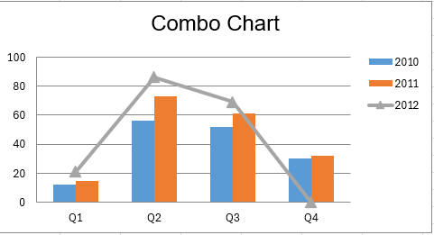


### Типы диаграмм

| константа класса<br/>Chart          | тип диаграммы                     |                                                                         |
|-------------------------------------|-----------------------------------|-------------------------------------------------------------------------|
| TYPE_BAR                            | линейчатая                        | 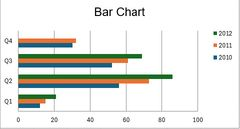                         |
| TYPE_BAR_STACKED                    | линейчатая с накоплением          | 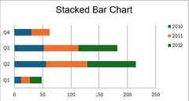         |
| TYPE_COLUMN                         | гистограмма                       | 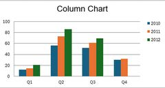                   |
| TYPE_COLUMN_STACKED                 | гистограмма с накоплением         | 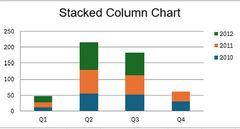   |
| TYPE_LINE                           | график                            | 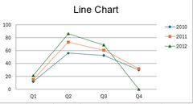                       |
| TYPE_LINE_STACKED                   | график с накоплением              | 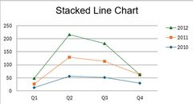       |
| TYPE_LINE_3D                        | объёмный график                   | 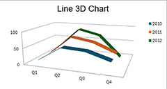                 |
| TYPE_LINE_3D_STACKED                | объёмный график с накоплением     | 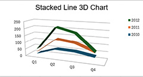 |
| TYPE_AREA                           | с областями                       | 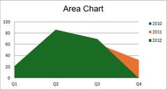                       |
| TYPE_AREA_STACKED                   | с областями с накоплением         | 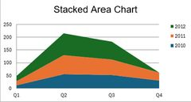       |
| TYPE_AREA_3D                        | объёмная с областями              | 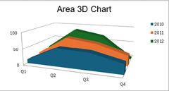                 |
| TYPE_AREA_3D_STACKED                | объёмная с областями с накоплением |        |
| TYPE_PIE                            | круговая                          | 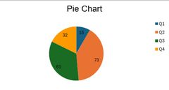                         |
| TYPE_PIE_3D                         | объёмная круговая                 | 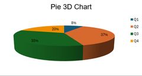                   |
| TYPE_DONUT                          | кольцевая                         | 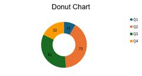                     |

### Полезные методы диаграмм

* setTitle(\<string>) — заголовок диаграммы
* setChartColors(\<array>) — цвета диаграммы
* setCategoryAxisLabels(\<range>) — подписи оси категорий
* setCategoryAxisTitle(\<string>) — заголовок оси категорий
* setValueAxisTitle(\<string>) — заголовок оси значений
* setLegendPosition(\<position>) — положение легенды (используйте константы Legend::POSITION_XXX)
* setPlotShowValues(true) — показывать значения на диаграмме
* setPlotShowPercent(true) — показывать значения в процентах (для круговых и кольцевых)
